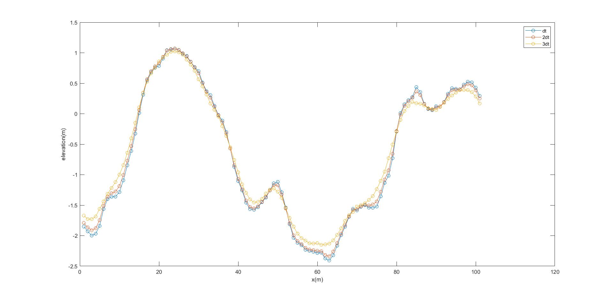
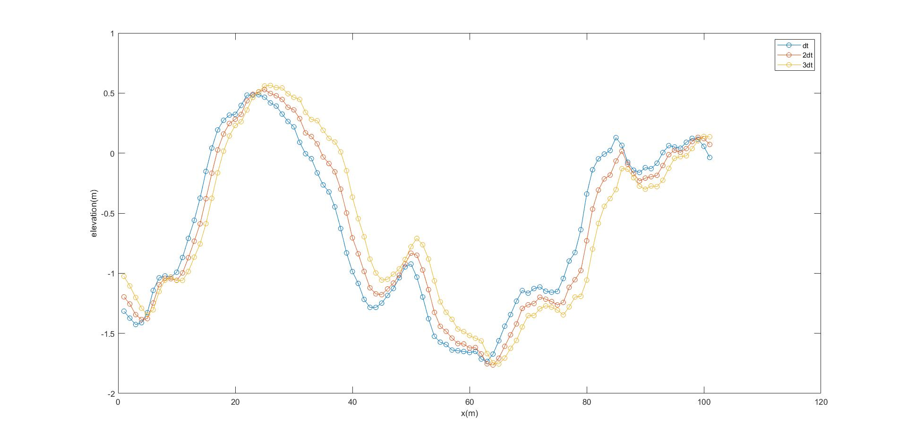

# Generating Sea Surface

This function based on a Monte-Carlo based method for generating one-way propagating ocean wave with given DWS (directional wave spectrum) model. This function is coded following the patent of invention by Chen Ping, Zou Shihao 2018.

* Chen Ping, Zou Shihao. “A Monte-Carlo-based method to generate one-way propagating ocean waves.” China, PatentNo. 201811400287.1

# 0. Preliminary Knowledge
The DWS (directional wave spectrum) is defined as the Fourier transform os the autocorrelation of sea surface. i. e.
$$
F(\overrightarrow{k})=FT\left(\left<
  \xi(\overrightarrow{x})\xi^{*}(\overrightarrow{x}+\overrightarrow{\Delta x})
  \right>\right)
$$
$x^*$ denotes the conjugatio of $x$, $<...>$ denotes the set average.
# 1. Monte-Carlo Method
At time $t$, a Monte-Carlo method establishes the sea surface at given psotion through the following equation [1]:
$$
\xi(x_p, y_q, t)=
  \Sigma_m\Sigma_n a_{mn} \frac{b_{mn}}{2}
  exp \left[j\left(
     k_{m}x_{p}+k_{n}y_{q}-\omega_{mn}t+\phi_{mn}
  \right)\right]
  \\
  k_m=\frac{2\pi}{L_x}\cdot m\\
  k_n=\frac{2\pi}{L_y}\cdot n\\
  x_p=\Delta x\cdot p\\
  y_q=\Delta y\cdot q\\

  \text{ }\\
  m,p=-\frac{M}{2}, -\frac{M}{2}+1,...\frac{M}{2}. \text{ where } M=\frac{L_x}{\Delta x}\\

  \text{ }\\
  n,q=-\frac{N}{2}, -\frac{N}{2}+1,...\frac{N}{2}. \text{ where } N=\frac{L_y}{\Delta y}\\
$$
$k_{m}, k_{n}$ denotes the ***m***th ***n***th discreted value of wavenumber along $k_x, k_y$ axis. $x_{p}, y_{q}$ denotes the ***p***th ***q***th discreted value of space position along $x, y$ axis. $\omega_{mn}$ denotes the angular frequency which is related to wavenumber by dispersion equation $\omega=\sqrt{kg},g=9.8m/s^2$. $\phi_{mn}$ denotes the initial phase following uniform distribution and $\phi_{mn}=\phi_{-m-n}$. $L_{x}, L_{y}$ denotes the simulated size of ocean area. $b_{mn}$ denotes a random variable with none unit subject to **Rayleigh distribution** with $\mu=0, \sigma=1$. $a_{mn}$ denotes the normalized amplitudes as a function of wavenumber $\overrightarrow{k}$. Its expression is:
$$
a_{mn}=\sqrt{2F(k_{m}, k_{n})\Delta k_{x}\Delta k_{y}}\\
\Delta k_{x}=\frac{2\pi}{L_{x}}\\
\Delta k_{y}=\frac{2\pi}{L_{y}}
$$
$\Delta k_{x}\Delta k_{y}$ denotes the resolution along $k_x, k_y$ axis. $F(k_{m}, k_{n})$ denotes the value of **non symmetric DWS** value at given position in wavenumber domain, its unit is $m^{4}$.

# 2. Correctness of this Method
How do we know if the generated sea surface is correct? The simplest way is to calculate the DWS of generated sea surface. If the DWS coincide with the given one, then the generated sea surface is correct. The correctness of this method is insured theoretically. Now, let's work it through.

First, we derive the autocorrelation of a given sea surface generated by the above method, which would be like this:
$$
\left< \xi(\overrightarrow{x})\xi(\overrightarrow{x}+\overrightarrow{\Delta x}) \right>=
  \Sigma_{m_1,n_1,m_2,n_2}\frac{\left< b_{m_{1}n_{1}}b_{m_{2}n_{2}} \right>}{4}\cdot X
$$
Now, let's ignore what does X look like and pay attention to the first term at the right side. We know that $b_{mn}$ is an indenpendent and identical variable. That gives us $\left< b_{m_{1}n_{1}}b_{m_{2}n_{2}} \right>\neq 0$ only when $m_1=m_2$ and $n_1=n_2$. With this condition, we are able to simplify the expression of $X$, then we have:
$$
\left< \xi(\overrightarrow{x})\xi(\overrightarrow{x}+\overrightarrow{\Delta x}) \right>=
  \Sigma_{m,n} a_{mn}^{2} \frac{\left<b_{mn}^{2}\right>}{4}exp\left[ j\left( k_m\Delta x+k_n\Delta y \right) \right]
$$
The second original moment of Rayleigh distribution is $2\sigma^{2}$. Substitute it into the above equation:
$$
\left< \xi(\overrightarrow{x})\xi(\overrightarrow{x}+\overrightarrow{\Delta x}) \right>=
  \Sigma_{m,n} \frac{a_{mn}^{2}}{2}exp\left[ j\left( k_m\Delta x+k_n\Delta y \right) \right]
$$
The Fourier transform $FT$ is defined as:
$$
FT\left(g(x)\right)=\frac{1}{2\pi}\int g(x)e^{-jkx}dx
$$
Therefore, the $FT$ of the autocorrelation of sea surface is:
$$
\begin{aligned}
FT(<...>)&=\frac{1}{4\pi^{2}}\iint \Sigma_{m,n} \frac{a_{mn}^{2}}{2}exp\left[ j\left( k_m\Delta x+k_n\Delta y \right) \right] exp\left[ -j\left( k_{m'}\Delta x+k_{n'}\Delta y \right) \right]dxdy\\

&=\frac{1}{4\pi^{2}}\cdot F(k_m, k_n)\Delta k_{x}\Delta k_{y} \cdot L_x L_y\\
&=F(k_m, k_n)
\end{aligned}
$$
See, the generated spectrum is exactly equal to the ground truth. That insured the correctness of this Monte-Carlo method.

# 3. Construction Unsymetric DWS
It should be noticed that to generate a one-way propagating ocean wave, we shoule first construct a **non symmetric DWS model**. However, all the empirical wave models are symmetric, including PM, DV, EL, JSON. That means $F(\overrightarrow{k})=F(\overrightarrow{-k})$. In this way, the opposite propagating waves split the energy averagely which would causes an odd wave that would not transmit over time. See Fig.1 Below.

Fig.1 Generated ocean wave using symmetric DWS (not propagating)

To insure conservation of energy meanwhile eliminate the one-way propagation of ocean waves, the fake direction area should be set to 0, and allocates all the energy to direction toward which the wave is supposed to propagate. Mathematically, 2 steps are taken:
$$
\begin{aligned}
&\text{For all } \Phi \text{ that satisfies } \left|\Phi-\Phi_0\right|\geq90^{o}, F(K,\Phi)=0.\\
&\text{For all } \Phi \text{ that satisfies } \left|\Phi-\Phi_0\right|\lt90^{o}, F(K,\Phi)=2F(K,\Phi).
\end{aligned}
$$
$\Phi_{0}$ denotes the peak wave pdrection for one single wave model. Cause you have to take the above 2 steps for each wave model if mixed sea condition is to simulate. With the processed DWS, the generated wave is one-way propagating. See Fig.2

Fig.2 Generated ocean wave using Unsymmetric DWS (propagating)

# 4. Relationship between FT and MATLAB's FFT2 function
