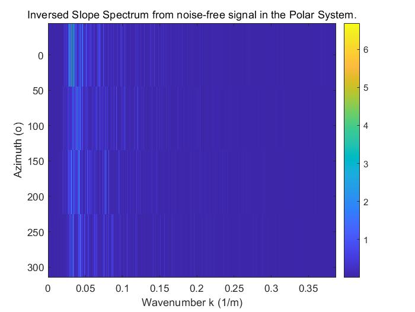
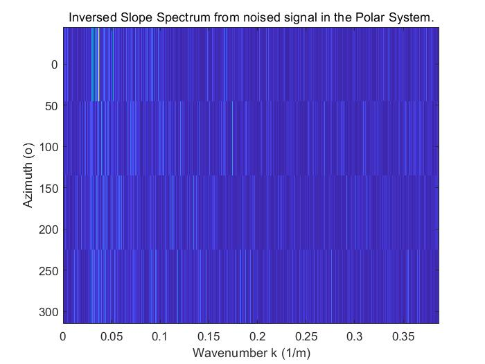
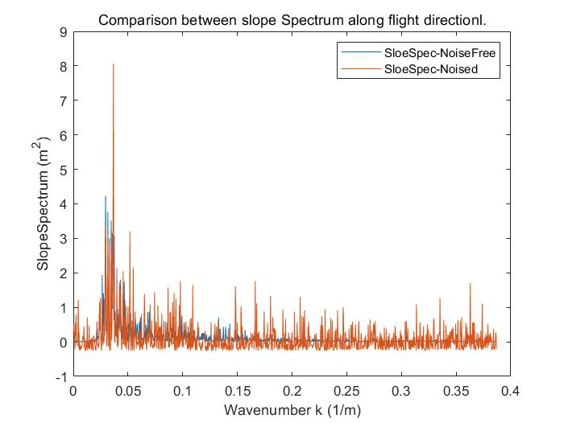

# SWIM Simulation
This software is constructed to simulate the DWS (dicrectional wave spectrum) detection process of SWIM onboard CFOSAT. You can find the detail description in Hauser et al. 2001 [1]. There are primarily 5 steps **(click on the link below to check the physical and mathematical mechanism of responding step)**: 

1. [Generating sea surface](Doc/GeneratingSeaSurface.pdf)**(Click here)**; 
2. [Calculating Backscattering Coefficients for each grid](Doc/CalculatingBackscatteringCoefficientsForEachGrid.pdf)**(Click here)**;
3. [Speckle noise simulation](https://journals.ametsoc.org/view/journals/atot/18/3/1520-0426_2001_018_0421_sarart_2_0_co_2.xml)(Origins from Hasuer 2001 [1]);
4. [Removal of deterministic parameters](https://www.aviso.altimetry.fr/fileadmin/documents/data/tools/SWIM_ProductUserGuide.pdf); 
5. [Spectrum estimation](https://www.aviso.altimetry.fr/fileadmin/documents/data/tools/SWIM_ProductUserGuide.pdf).

For simulation principle of each step, please directly refer to the link underlying above. If you are interested in the measured data of SWIM please go to the [AVISO+ website about wave/wind CFOSAT products](https://www.aviso.altimetry.fr/en/data/products/wind/wave-products/wave-wind-cfosat-products.html) or [卫星海洋应用中心数据下载中心](https://osdds.nsoas.org.cn/) for more details.

# Install
This project is constructed with 100% MATLAB codes. So before running, the only thing you need to do is install MATLAB >= 2017a and download all the source files.

# Usage
There is alreadly a small exp set for you to play around. Simply run the main.m file with MATLAB's running buttom or print `run main` in MATLAB console. At the end, a comparison between detected slope spectrum and ground truth is performed. And 3 figs including detected slope spectrum, ground truth spectrum, and comparison between them along flight movement would be shown:

You can set breakpoints anywhere to understand the working mechanism of this project. However, reading the simulation principle listed above can prepare you well for understanding of the underlying physical and mathematical basis, and assist greatly if you tend to customize on your own.

# Configuration File
Configuration file `ParaConfig.json` listed all the parameters you can change without breaking the physical rules behind the codes. Details of each parameter are listed below:

| Parameter Name     | Representation     | Unit     |
| -------- | -------- | -------- |
| `IncidentAngle` | 6 different incident angles of SWIM | Degree |
| `RadarGates` | Number of smallest resolution zones along radious direction | None |
| `PulsesEachMicroCycle` | Number of pulses each radar transmits during the integration time | None |
| `TransmitPower` | Transmitting power of radar | KW |
| `WorkingFrequency` | Center frequency of radar | Hz |
| `LightSpeed` | No need to explain | m/s |
| `RotatingSpeed` | Rotating speed of boards where radars are set on | Degree/s |
| `IncidentAngleIndex` | Index of the incident angle you choose to simulated according to `IncidentAngle` | None |
| `ExpCounts` | Number of time simulation is cast | None |
| `OceanWaveType` | An array inlcuding all the kinds of waves you want to simulate. A wind wave must be included | None |
| `OceanParameters` | Parameters required to generate each kind of waves | None |
| `ObservingIntervalAngle` | Angle between the successive radar scanning | Degree |

**Attetion**: The simulated ocean area is determined by the 3dB beam projected on the horizontal plane at 0 altitude. **So, don't simply change the number of spliting bins of the ocean area, the correctness of speckle noise simulation relies in the coincidence between `spliting size` and `resolution*radar gates`.**

# Reference
1. Hauser D, Soussi E, Thouvenot E, et al. SWIMSAT: A real-aperture radar to measure directional spectra of ocean waves from space--main characteristics and performance simulation. Journal of Atmospheric & Oceanic Technology, 2001, 18(3):421-437.
